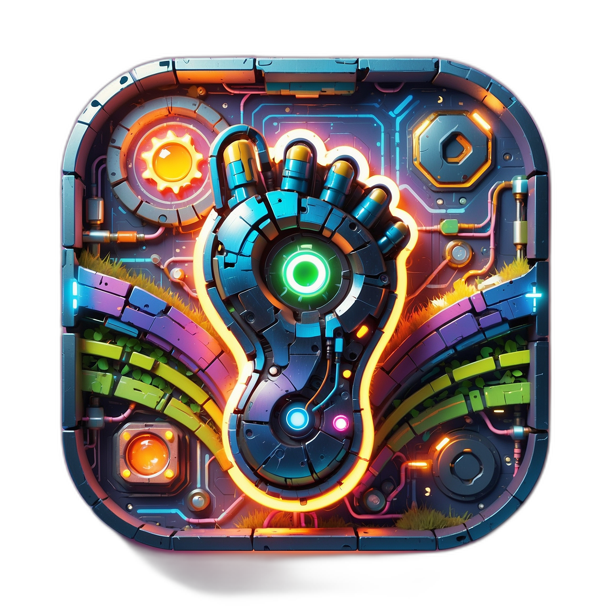

<p align="center">
  
</p>

# Underfoot Underground Travel Planner

> 🦄 This project was created as an entry for [Dev's n8n/BrightData Challenge](). You can read my submission post [Underfoot: The ChatPot for Hidden Places](https://dev.to/anchildress1/underfoot-the-chatpot-for-hidden-places-and-why-i-dont-do-hackathons-2684) — including all the ups and downs— along with my follow up [The Hackathon I Swore Off](https://dev.to/anchildress1/the-hackathon-i-swore-off-and-the-exhaustion-that-mostly-compiled-c4l) available on my blog. I definitely plan to keep working on this, because I fell in love with this project. Timing though? There's a ton of other things at the top of the list. So, for now it's on the back-burner as much as my "hold on tight" instinct will let me anyway. 😆
>
> P.S. I did keep notes of in a [JOURNEY](./docs/JOURNEY.md) file, because... why not?

---

> [!WARNING]
> Copilot 100% wrote the documentation for this project. While I did review and it all _sounds_ great — the majority of it is where I want the project to be — not necessarily where it is at this present moment.

---

🧭 Quirky, snarky, _absolutely-not-your-typical_ travel planner for finding the coolest, least obvious spots — the ones the big travel sites forgot.

Underfoot helps you find hidden gems in any given location by digging into local blogs, indie magazines, and offbeat sources. No TripAdvisor Top 10 lists here — we’re all about the “Wait, this exists?!” moments.

## ✨ Repo Pulse: Badges, Stars & Fuel

If you find this project useful or want to support its development, consider sharing it, starring the repo, or even buying me a coffee! Your support keeps the code flowing and the caffeine strong 💪

| Pulse Points | Badges |
| - | - |
| 🫶 Show Some Love | [](https://dev.to/anchildress1) [](https://www.linkedin.com/in/anchildress1/) [](https://medium.com/@anchildress1) [](https://www.reddit.com/user/anchildress1/) [](https://youtube.com/@anchildress1) [](https://www.buymeacoffee.com/anchildress1) |
| 🛼 Recent Activity | <br/><br/> [](https://wakatime.com/badge/user/ce7cc1c3-1f1a-4f77-ad68-9e3a9caac39b/project/274505a2-d55b-4b16-9479-661b724d63e6) |
| 📊 At a Glance | [](https://project-types.github.io/) [](https://dev.to/challenges/brightdata-n8n-2025-08-13) |
| 🧩 The Non-Negotiable | [](https://volta.sh) [](https://www.npmjs.com/) [](https://nodejs.org/)<br/>[](https://developer.mozilla.org/en-US/docs/Web/JavaScript)  [](https://www.markdownguide.org) |
| 🔧 Nerd Tools I Can't Live Without<br/>- Dependencies | [](https://conventionalcommits.org/) [](https://commitlint.js.org/) <br /> |
| 👾 Bots in the Basement | [](https://github.com/features/copilot) [](https://openai.com/chatgpt) |
| 💬 Meta Magic & Shiny Things<br/> | [](https://git-scm.com/) [](https://github.com/) [](https://www.toptal.com/developers/gitignore/api/node,dotenv,visualstudiocode,macos)<br/>[](https://shields.io/badges/static-badge) <br/>[](https://code.visualstudio.com/updates/v1_102) [](https://www.apple.com/shop/buy-mac?afid=p240%7Cgo~cmp-21640797485~adg-171722772185~ad-756023446016_kwd-978205588~dev-c~ext-~prd-~mca-~nt-search&cid=aos-us-kwgo-mac-bts-launch-061725-) |

---

## Features (Planned)

- 🎯 Location-based underground travel picks
- 🗓️ Flexible date range search (always slightly broadened for best results)
- 🕵️ Sources: local blogs, indie publications, and niche community recs
- 🛡️ Privacy-first — all API keys live in `.env`
- 🖥️ Debug view for server output

### Labs Context

This is the first **Labs** repo — our hackathon playground for weird, experimental, and possibly genius projects. If it’s useful, fun, or both, it stays.

---

## Environment Setup

Copy `.env.example` → `.env` and update values:

```env
# Vite configs
VITE_API_BASE=https://api.example.com
VITE_LIMIT=100

# OpenAI API key
OPENAI_API_KEY=your_api_key_here

# Default search radius in miles
DEFAULT_RADIUS=10

# Default date range extension in days
DEFAULT_DATE_EXTEND=3

# Server port
PORT=3000
```

---

## Getting Started

```bash
# Install deps (Node 22 LTS recommended)
npm install

# Run in dev mode
npm run dev

# Build for production
npm run build

# Frontend container
docker build -t underfoot-frontend -f frontend/Dockerfile .

# Backend container
docker build -t underfoot-backend -f backend/Dockerfile .

```

---

## Streaming Chat (SSE)

The backend supports an EventSource-compatible pseudo-streaming interface (currently a single final payload framed as events; ready to evolve into true token streaming).

Endpoint (GET):

```
/underfoot/chat?chatInput=Your+prompt&stream=true
```

Events (protocolVersion 1):

| Event | Data Shape | Notes |
| - | - | - |
| `start` | `{ requestId, protocolVersion:1, cacheHit:boolean }` | First event confirming stream accepted |
| `complete` | Full JSON chat payload (`{ response, items?, debug }`) | Same object shape as POST response |
| `heartbeat` | `{ ts, requestId }` | Sent every \~20s if connection held long enough |
| `error` | `{ message, fatal?, requestId }` | Only on internal failure before completion |
| `end` | `{ requestId }` | Terminates stream |

Cache hits emit: `start(cacheHit:true)` → `complete` → `end` rapidly.

Environment variables:

```
SSE_MAX_CONNECTIONS=100 # optional cap on concurrent streams
```

Example (browser):

```js
const es = new EventSource('/underfoot/chat?stream=true&chatInput=' + encodeURIComponent('Hello'));
es.addEventListener('complete', (e) => {
  const data = JSON.parse(e.data);
  console.log('Reply:', data.response);
});
es.addEventListener('end', () => es.close());
```

Non‑streaming: You can use `POST /underfoot/chat` with `{ "chatInput": "Hello" }`.

### Cloudflare Worker (Optional API Deployment)

This repo includes an experimental Cloudflare Worker backend in `cloudflare-worker/` mirroring the Node Express routes. Quick start:

```bash
npm install
npx wrangler login
cd cloudflare-worker
wrangler secret put STONEWALKER_WEBHOOK # enter your upstream URL
wrangler deploy
```

Then set `VITE_API_BASE` to the Worker URL for the frontend build.

---

## n8n Workflows Code

The automation workflows powering the experimental chat / data stitching layer (used during the hackathon phase) are published as a sharable gist so you can import or remix them directly inside your own n8n instance:

Import Instructions (quick):

1. Open your n8n dashboard.
2. Create New Workflow → Menu (⋮) → Import from URL.
3. Paste the gist raw URL (or download the JSON and import from file).
4. Review credentials placeholders, add your own keys (OpenAI, data sources, etc.).
5. Activate and test.

Notes:

- Gist may evolve; pin a specific revision hash if you need reproducibility.
- Secrets are never stored in the gist—remember to configure them locally.
- Feel free to open an issue suggesting enhancements to the workflows.

---

## License 📄

Every project has to have a stack of fine print somewhere. _Keep going, keep going, keep going..._ Here's mine, as painless as possible:

You know where [the license](./LICENSE) is, but I'll sum it up: **this is not open source** (even though you can still do just about anything you want with it). Do what you want—as long as you're not turning it into the next big SaaS or selling subscriptions in the cloud. For that, **you've gotta ask me first.**

Basically? This project's got boundaries. Be cool, don't try to sneak it into a product launch, and we'll get along just fine. 😘

---

<small>🛡️ This entire project was built with the help of ChatGPT and GitHub Copilot</small>
