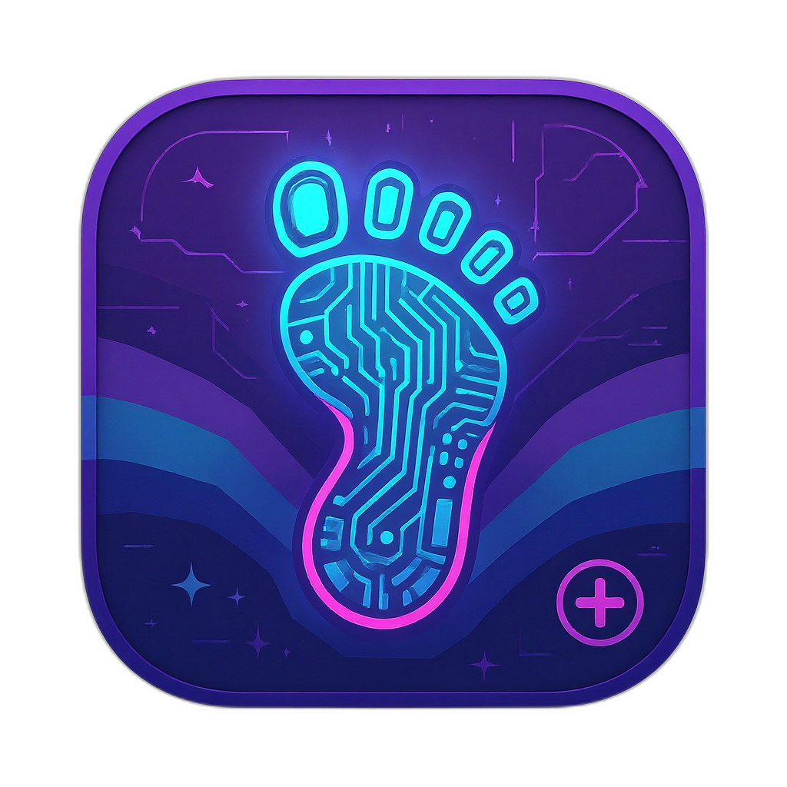

# Underfoot Underground Travel Planner

<p align="center">
  
</p>

> 🦄 Yes — I know\... _another_ project. It can't be helped! I really do plan on finishing them all (at some point). So, since I'm already over-worked and short on time as-is. Here's my 2nd attempt at **vibe coding** with ChatGPT at the wheel and GitHub Copilot playing backup. We'll see how it goes without me going to crazy with the overbearing-OCD. 🤞
>
> P.S. I'll keep notes of how it goes in the [JOURNEY](./docs/JOURNEY.md) file, because... why not?

🧭 Quirky, snarky, _absolutely-not-your-typical_ travel planner for finding the coolest, least obvious spots — the ones the big travel sites forgot.

Underfoot helps you find hidden gems in any given location by digging into local blogs, indie magazines, and offbeat sources. No TripAdvisor Top 10 lists here — we're all about the "Wait, this exists?!" moments.

## ✨ Repo Pulse: Badges, Stars & Fuel

If you find this project useful or want to support its development, consider sharing it, starring the repo, or even buying me a coffee! Your support keeps the code flowing and the caffeine strong 💪

| Pulse Points | Badges |
| - | - |
| 🫶 Show Some Love | [](https://dev.to/anchildress1) [](https://www.linkedin.com/in/anchildress1/) [](https://www.buymeacoffee.com/anchildress1) |
| 🛼 Recent Activity |  <br/> [](https://wakatime.com/badge/github/ChecKMarKDevTools/underfoot-underground-travel-planner) |
| 📊 At a Glance | [](https://project-types.github.io/) [](./LICENSE) [](https://dev.to/challenges/brightdata-n8n-2025-08-13) |
| 🧩 The Non-Negotiable | [](https://volta.sh) [](https://www.npmjs.com/) [](https://nodejs.org/)<br/>[](https://developer.mozilla.org/en-US/docs/Web/JavaScript) [](https://www.markdownguide.org)<br/> |
| 🔧 Nerd Tools I Can't Live Without<br/>- Dependencies | [](https://conventionalcommits.org/) [](https://commitlint.js.org/) |
| 👾 Bots in the Basement | [](https://github.com/features/copilot) [](https://openai.com/chatgpt) [](https://verdent.ai/) |
| 💬 Meta Magic & Shiny Things | [](https://git-scm.com/) [](https://github.com/) [](https://www.toptal.com/developers/gitignore/api/node,dotenv,visualstudiocode,macos) [](https://code.visualstudio.com/updates/v1_102) [](https://www.apple.com/shop/buy-mac?afid=p240%7Cgo~cmp-21640797485~adg-171722772185~ad-756023446016_kwd-978205588~dev-c~ext-~prd-~mca-~nt-search&cid=aos-us-kwgo-mac-bts-launch-061725-)<br/>[](https://shields.io/badges/static-badge)  |

### Labs Context

This is the first **Labs** repo — our hackathon playground for weird, experimental, and possibly genius projects. If it's useful, fun, or both, it stays.

---

## ✨ Current Status: Active Development

**🎯 Target Deployment**: `checkmarkdevtools.dev/underfoot`
**🏗️ Architecture**: Python Workers + Supabase + React
**🎨 Design System**: Dream Horizon (accessible underground theme)
**📊 Test Coverage**: 96.99% with comprehensive end-to-end testing

### Recent Achievements

- ✅ Multi-API integration (OpenAI, Reddit, SERP, Eventbrite)
- ✅ Smart geocoding with location validation
- ✅ Streaming chat interface with SSE
- ✅ Security-first middleware (rate limiting, XSS protection)
- ✅ Comprehensive test suite with high coverage

### Roadmap

- 🚀 Python Workers migration (Week 1)
- 🎨 Dream Horizon UI implementation (Week 1)
- 🗺️ Google Maps integration with $300 GCP credits (Week 2)
- 🧠 Vector search caching with Supabase (Week 2)
- 🌐 Production deployment to checkmarkdevtools.dev/underfoot (Week 3)

---

## Features (Planned)

- 🎯 Location-based underground travel picks
- 🗓️ Flexible date range search (always slightly broadened for best results)
- 🕵️ Sources: local blogs, indie publications, and niche community recs
- 🛡️ Privacy-first — all API keys live in `.env`
- 🖥️ Debug view for server output
- 🧠 Smart context (e.g., "graveyards" → suggests haunted houses)
- 📊 Result scoring with underground keyword detection
- 💾 Vector search caching for improved performance

---

## Environment Setup

Copy `.env.example` → `.env` and update values:

```env
# Vite configs
VITE_API_BASE=https://api.example.com
VITE_LIMIT=100

# OpenAI API key
OPENAI_API_KEY=your_api_key_here

# Optional: External API keys for enhanced results
REDDIT_CLIENT_ID=your_reddit_client_id
REDDIT_CLIENT_SECRET=your_reddit_client_secret
SERP_API_KEY=your_serp_api_key
EVENTBRITE_TOKEN=your_eventbrite_token

# Default search radius in miles
DEFAULT_RADIUS=10

# Default date range extension in days
DEFAULT_DATE_EXTEND=3

# Server port
PORT=3000

# Optional: SSE configuration
SSE_MAX_CONNECTIONS=100
```

---

## Getting Started

```bash
# Install deps (Node 22 LTS recommended)
npm install

# Run in dev mode
npm run dev

# Build for production
npm run build

# Run tests with coverage
npm run test:coverage

# Frontend container
docker build -t underfoot-frontend -f frontend/Dockerfile .

# Backend container
docker build -t underfoot-backend -f backend/Dockerfile .
```

---

## Streaming Chat (SSE)

The backend supports an EventSource-compatible pseudo-streaming interface (currently a single final payload framed as events; ready to evolve into true token streaming).

Endpoint (GET):

```
/underfoot/chat?chatInput=Your+prompt&stream=true
```

Events (protocolVersion 1):

| Event | Data Shape | Notes |
| - | - | - |
| `start` | `{ requestId, protocolVersion:1, cacheHit:boolean }` | First event confirming stream accepted |
| `complete` | Full JSON chat payload (`{ response, items?, debug }`) | Same object shape as POST response |
| `heartbeat` | `{ ts, requestId }` | Sent every \~20s if connection held long enough |
| `error` | `{ message, fatal?, requestId }` | Only on internal failure before completion |
| `end` | `{ requestId }` | Terminates stream |

Cache hits emit: `start(cacheHit:true)` → `complete` → `end` rapidly.

Example (browser):

```js
const es = new EventSource('/underfoot/chat?stream=true&chatInput=' + encodeURIComponent('Hello'));
es.addEventListener('complete', (e) => {
  const data = JSON.parse(e.data);
  console.log('Reply:', data.response);
});
es.addEventListener('end', () => es.close());
```

Non‑streaming: You can use `POST /underfoot/chat` with `{ "chatInput": "Hello" }`.

---

## 🎨 Design System: Dream Horizon

### Color Palette

```css
:root {
  /* Light Theme */
  --color-bg: #fdfdfe; /* Pearl White */
  --color-surface: #f3f5f8; /* Mist Surface */
  --color-text: #0d1b2a; /* Midnight Navy */
  --color-accent: #9d4edd; /* Aurora Purple */
  --color-info: #1faaa0; /* Soft Teal */
  --color-cta: #ff914d; /* Mid Orange */

  /* Dark Theme */
  --color-bg-dark: #0a0e1a; /* Deep Space */
  --color-surface-dark: #1a1f2e; /* Dark Surface */
  --color-text-dark: #fdfdfe; /* Pearl White */
}
```

### Typography

- **Headers**: Google Flavors (mystical, underground theme)
- **Body**: Inter (clean, accessible, readable)
- **Code**: JetBrains Mono (development context)

---

## 🧪 Testing

### Test Coverage: 96.99%

```bash
# Run all tests
npm test

# Run with coverage report
npm run test:coverage

# Run specific test suites
npm run test:unit
npm run test:integration
npm run test:e2e

# Watch mode for development
npm run test:watch
```

---

### Cloudflare Worker (Optional API Deployment)

This repo includes an experimental Cloudflare Worker backend in `cloudflare-worker/` mirroring the Node Express routes. Quick start:

```bash
npm install
npx wrangler login
cd cloudflare-worker
wrangler secret put STONEWALKER_WEBHOOK # enter your upstream URL
wrangler deploy
```

Then set `VITE_API_BASE` to the Worker URL for the frontend build.

---

## n8n Workflows Code

The automation workflows powering the experimental chat / data stitching layer (used during the hackathon phase) are published as a sharable gist so you can import or remix them directly inside your own n8n instance:

👉 <https://gist.github.com/anchildress1/cab1237affe75f0bed6629faeb940f2c>

Import Instructions (quick):

1. Open your n8n dashboard.
2. Create New Workflow → Menu (⋮) → Import from URL.
3. Paste the gist raw URL (or download the JSON and import from file).
4. Review credentials placeholders, add your own keys (OpenAI, data sources, etc.).
5. Activate and test.

Notes:

- Gist may evolve; pin a specific revision hash if you need reproducibility.
- Secrets are never stored in the gist—remember to configure them locally.
- Feel free to open an issue suggesting enhancements to the workflows.

---

## 🤝 Contributing

### Development Workflow

1. Fork the repository
2. Create feature branch: `git checkout -b feature/amazing-feature`
3. Commit changes: `git commit -m 'feat: add amazing feature'`
4. Push to branch: `git push origin feature/amazing-feature`
5. Open Pull Request

### Code Standards

- **Commits**: [Conventional Commits](https://conventionalcommits.org/)
- **Linting**: ESLint + Prettier
- **Testing**: Minimum 90% coverage for new code
- **Security**: No hardcoded secrets, XSS protection required

---

## License: The "Don't Be a Dick" Clause 📄

**[PolyForm Shield 1.0.0](./LICENSE)** - Open-ish source with boundaries. (Full legalese for the lawyers.)

### What You CAN Do (Go Wild) 🎭

- ✅ Fork it, modify it, break it, fix it—learning is encouraged
- ✅ Use it for personal projects, portfolio pieces, experiments
- ✅ Deploy it internally at your company (yes, even Fortune 500s)
- ✅ Contribute back improvements (please do!)
- ✅ Share it, teach with it, blog about it

### What You CAN'T Do (Don't Be That Person) 🚫

- ❌ Sell this as a SaaS product
- ❌ Rebrand it as "YourBrand™ Underground Travel Finder Pro Plus Premium" and charge $29/month
- ❌ Basically: Don't turn my free code into your paid business model

### Want to Use It Commercially? 💰

Cool! Just [ask first](mailto:human@checkmarkdevtools.dev). I'm reasonable—unlike the 47-page licensing agreements you're used to reading.

---

<p align="center">
  <em>Built with ❤️ and way too much coffee</em><br>
  <small>🛡️ This entire project was built with the help of ChatGPT, GitHub Copilot, and Verdent AI</small>
</p>
