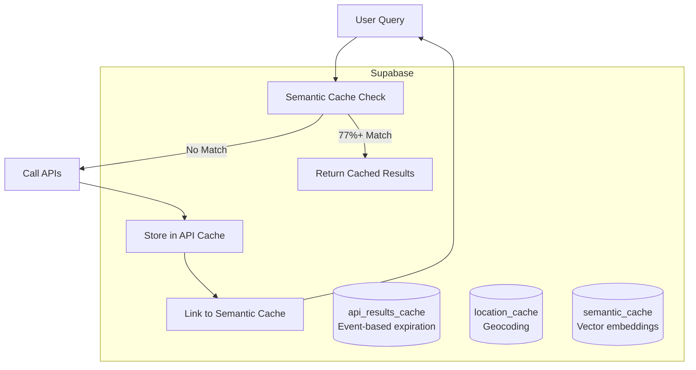

# Supabase Vector Search Cache

**Event-based caching with semantic search for underground travel results.**

## Quick Overview

This Supabase setup does two things:

1. **Caches API results** (Reddit, Facebook, Eventbrite, SERP) until events expire
2. **Semantic search** to find similar queries (e.g., "graveyards" matches "haunted houses")

No arbitrary TTLs. Events expire when `event_date < now()`. Simple.

---

## Architecture



---

## Tables

### api\_results\_cache

**Purpose**: Raw API data with event-based expiration

| Column | Type | Description |
| - | - | - |
| `id` | uuid | Primary key |
| `source` | text | API source: `reddit`, `facebook`, `eventbrite`, `serp` |
| `result_data` | jsonb | Full API response |
| `location` | text | Location string |
| `latitude`/`longitude` | decimal | Coordinates for filtering |
| `event_date` | timestamptz | Event date (default: now + 4 weeks) |
| `created_at` | timestamptz | Cache timestamp |

**Expiration**: `event_date < now()` = expired. Cleanup function runs periodically.

---

### location\_cache

**Purpose**: Geocoding cache (saves Google Maps API costs)

| Column | Type | Description |
| - | - | - |
| `id` | uuid | Primary key |
| `raw_input` | text | User's location input (unique) |
| `normalized_location` | text | Standardized location name |
| `confidence` | float | Geocoding confidence (0.0-1.0) |
| `raw_candidates` | jsonb | All geocoding candidates |
| `expires_at` | timestamptz | TTL expiration |

**Expiration**: Standard TTL (not event-based).

---

### semantic\_cache

**Purpose**: Vector search index for query similarity

| Column | Type | Description |
| - | - | - |
| `id` | uuid | Primary key |
| `intent` | text | User's search query |
| `intent_embedding` | vector(1536) | OpenAI embedding |
| `location` | text | Location string |
| `city`/`region`/`country` | text | Geocoded details |
| `latitude`/`longitude` | decimal | Coordinates |
| `result_ids` | uuid\[] | References to `api_results_cache` |
| `access_count` | int | Cache hit counter |
| `last_accessed` | timestamptz | Last hit timestamp |
| `expires_at` | timestamptz | Cache expiration |

**Search Algorithm**:

- **Similarity threshold**: 77%
- **Max distance**: 80 miles
- **Scoring**: 70% intent similarity + 30% proximity (exponential decay)

---

## Functions

### `find_similar_intents_nearby`

Vector similarity search with geographic filtering.

**Parameters**:

- `input_intent_embedding`: vector(1536) - Query embedding
- `user_lat`/`user_lng`: decimal - User coordinates
- `max_distance_miles`: int (default: 80)
- `intent_similarity_threshold`: float (default: 0.77)
- `result_limit`: int (default: 6)

**Returns**: Up to 6 results with similarity + distance scores.

**Example**:

```sql
SELECT * FROM find_similar_intents_nearby(
  embedding,
  37.7749,  -- SF latitude
  -122.4194, -- SF longitude
  80,
  0.77,
  6
);
```

---

### `clean_expired_cache`

Removes expired cache entries from all tables.

**Returns**: JSON with deletion counts

```json
{
  "location_cache_deleted": 5,
  "semantic_cache_deleted": 12,
  "api_results_deleted": 43,
  "cleanup_time": "2025-10-08T18:30:00Z"
}
```

---

### `get_cache_statistics`

Returns comprehensive cache stats.

**Example Output**:

```json
{
  "api_results": {
    "total_count": 1247,
    "active_count": 823,
    "expired_count": 424,
    "by_source": {
      "reddit": 312,
      "eventbrite": 289,
      "serp": 142,
      "facebook": 80
    }
  },
  "semantic_cache": {
    "total_count": 156,
    "active_count": 134,
    "total_accesses": 4892,
    "avg_access_count": 31.4
  },
  "config": {
    "similarity_threshold": 0.77,
    "max_distance_miles": 80,
    "default_event_ttl_weeks": 4
  }
}
```

---

## Security

**RLS Policies**: Public access for pre-beta (no auth yet).

All functions use `SECURITY DEFINER` with `SET search_path = public, pg_temp` to prevent injection attacks.

**⚠️ TODO**: Restrict RLS policies when adding authentication.

---

## Local Development

```bash
# Start Supabase locally
supabase start

# Apply migrations
supabase db reset

# Check migration status
supabase migration list
```

---

## Deployment

```bash
# Link to cloud project
supabase link --project-ref <your-project-ref>

# Push migrations
supabase db push --linked
```

**Current Project**: `kemxwibutocuppfuagkp` (us-east-1)

---

## Maintenance

**Cleanup Schedule**: Run `clean_expired_cache()` daily via cron or edge function.

**Monitoring**: Use `get_cache_statistics()` to track cache performance.

---

<small>Generated with GitHub Copilot as directed by Ashley Childress</small>
