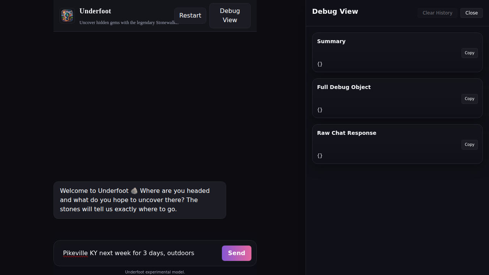

# Debug View (Power Users)

The Debug View provides detailed technical information about how Underfoot processed your query and found recommendations. This is useful for understanding the system, troubleshooting issues, and optimizing your searches.

## Accessing Debug View


*Debug View panel showing detailed processing information*

To open the Debug View:
1. Look for the **"Debug View"** button in the top-right corner
2. Click to open the side panel
3. The panel shows information about your most recent query

## What You'll See

### Summary Section
Quick overview of the most recent query:
- **Request ID**: Unique identifier for this search
- **Execution Time**: How long the search took (in milliseconds)
- **Upstream Status**: Success/error status from data sources
- **Cache Status**: Whether results came from cache or fresh search

### Full Debug Object
Complete technical details including:
- **Search parameters** extracted from your message
- **Data source responses** and timing
- **Filtering and ranking** process details
- **Error information** if any issues occurred

### Raw Chat Response
The complete JSON response from the backend:
- **Structured result data** before formatting
- **Metadata** about sources and confidence
- **Processing details** for each step

## Understanding the Information

### Request Processing
```json
{
  "requestId": "uf_demo_123",
  "executionTimeMs": 1234,
  "messageEcho": "Pikeville KY, outdoors, hiking trails"
}
```

- **requestId**: Unique identifier for tracking this specific search
- **executionTimeMs**: Total time to process your request
- **messageEcho**: Your original message as understood by the system

### Upstream Data Sources
```json
{
  "upstream": {
    "status": 200,
    "candidateCount": 5,
    "elapsedMs": 856
  }
}
```

- **status**: HTTP status code (200 = success)
- **candidateCount**: Number of initial recommendations found
- **elapsedMs**: Time spent gathering data from sources

### Cache Information
```json
{
  "cache": {
    "hit": false,
    "ttlSeconds": 3600
  }
}
```

- **hit**: Whether this query was served from cache
- **ttlSeconds**: How long results are cached (Time To Live)

## Using Debug Information

### Performance Optimization
- **High execution times** (>5000ms) may indicate:
  - Data source delays
  - Complex query processing
  - Network issues

### Quality Assessment  
- **Low candidate counts** (<3) may mean:
  - Query too specific
  - Limited data for that location
  - Need to broaden search criteria

### Cache Behavior
- **Cache hits** provide faster responses
- **Fresh searches** ensure up-to-date information
- Use **force refresh** to bypass cache when needed

## Copy Functions

Each section has a **"Copy"** button to copy the JSON data to your clipboard:
- **Summary Copy**: Key metrics only
- **Full Debug Copy**: Complete processing information  
- **Response Copy**: Raw backend response

This is useful for:
- **Sharing with support** if you encounter issues
- **Analyzing patterns** in your search behavior
- **Technical debugging** of the system

## Debug History

The Debug View maintains a history of recent queries:
- **Timestamps** showing when each query was made
- **Request IDs** for tracking specific searches
- **Quick access** to previous debug information

Click on any historical entry to view its debug details.

## Common Debug Scenarios

### Slow Response Times
**Symptoms**: High `executionTimeMs` values
**Possible causes**:
- Data source delays
- Complex location parsing
- Network connectivity issues

### Low-Quality Results  
**Symptoms**: Low `candidateCount`, generic sources
**Possible causes**:
- Query too broad or too narrow
- Limited local data available
- Need more specific location information

### Cache Issues
**Symptoms**: Outdated recommendations, cache hit when expecting fresh data
**Solutions**:
- Use "force refresh" option
- Check `ttlSeconds` for cache expiration
- Clear browser cache if needed

## Privacy and Data

### What's Logged
- Query processing metrics
- Source response times
- Error conditions and retry attempts
- **Not logged**: Personal information, exact location details

### Temporary Data
- Debug information is **session-only**
- History clears when you reload the page
- No persistent tracking of individual users

## Troubleshooting with Debug View

### Error Codes
- **200-299**: Successful processing
- **400-499**: Client-side issues (invalid query, location not found)  
- **500-599**: Server-side issues (data source problems, processing errors)

### Retry Information
```json
{
  "retries": {
    "sources": {
      "reddit": 1,
      "local_blogs": 0
    }
  }
}
```

Shows how many times the system retried failed data sources.

### Performance Baseline
- **Good response times**: <2000ms
- **Acceptable**: 2000-5000ms  
- **Slow**: >5000ms (consider simplifying query)

## Advanced Features

### Force Refresh
When enabled, bypasses cache to ensure fresh results:
- Use when locations have recent changes
- Helpful for time-sensitive recommendations
- Results in longer response times

### Background Interaction
Option to keep Debug View open while continuing to chat:
- Monitor multiple queries in sequence
- Compare processing across different search terms
- Track performance patterns

## Next Steps

- Learn about [Chat-Based Planning](./chat-planning.md)
- Understand [Result Cards](./result-cards.md) 
- Check [Common Issues](../troubleshooting/common-issues.md) for specific problems