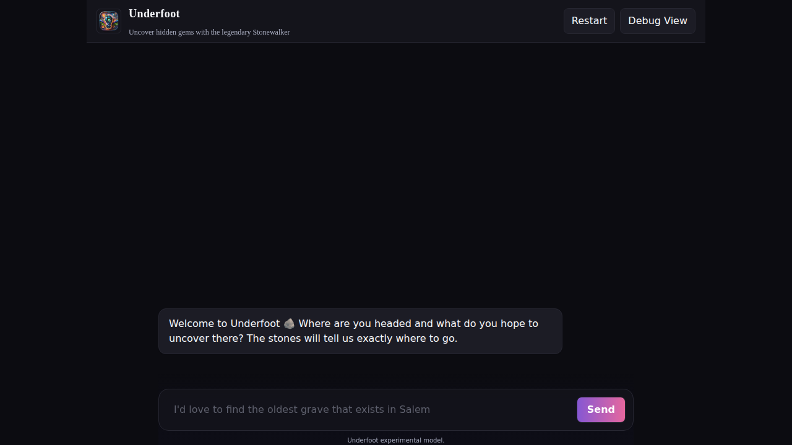
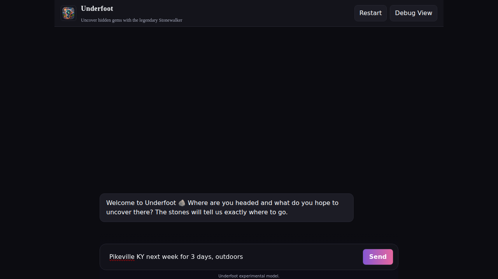

# How to Use the Chat Interface

The Underfoot chat interface is designed to be simple and intuitive, similar to chatting with a knowledgeable local friend.

## Starting a Conversation

*The Underfoot chat interface on first load*

When you first visit Underfoot, you'll see:
- 📱 **Clean chat interface** with the Underfoot logo
- 💬 **Message input area** at the bottom
- 🔍 **Debug View button** in the top right (for power users)

## Composing Your Message

*The message input area when focused*

The message input supports:
- **Single-line messages** - Press `Enter` to send
- **Multi-line messages** - Press `Shift + Enter` for new lines
- **Auto-resize** - The input grows as you type longer messages

### What to Include in Your Message

For best results, include:

1. **📍 Location**: Where you're going
   - Examples: "Portland, Oregon", "Tokyo", "near Yellowstone National Park"

2. **📅 Time frame**: When you're visiting (optional)
   - Examples: "next weekend", "in July", "this winter"

3. **🎯 Interests/Activities**: What you enjoy
   - Examples: "outdoors", "food", "history", "art", "music", "quirky", "hiking"

### Example Messages

*Example message ready to send*

**Good examples:**
- `"Pikeville KY, outdoors, hiking trails"`
- `"Portland Oregon next week, coffee shops and quirky bookstores"`
- `"Near Austin Texas, live music venues locals actually go to"`
- `"Small towns around Denver, family-friendly but not touristy"`

**Pro tip:** Be specific about what makes something "underground" or "hidden" to you!

## Sending Your Message

Click the **Send** button or press `Enter` to send your message. You'll see:
1. Your message appears in the chat
2. Underfoot starts processing your request
3. A response appears with personalized recommendations

## Getting Your Results

*Chat showing travel recommendations with result cards*

After sending your message, you'll receive:
- 📝 **Personalized response** explaining the recommendations
- 🃏 **Result cards** with detailed information about each place
- 🔍 **Debug information** (accessible via Debug View)

Each result card includes:
- **Name and description** of the place
- **Rating** from local sources
- **Source** where the recommendation came from
- **Link** to learn more

## Tips for Better Conversations

1. **Be conversational** - Write like you're talking to a friend
2. **Include context** - Mention what you want to avoid ("not the usual tourist spots")
3. **Ask follow-ups** - Continue the conversation to refine your results
4. **Be specific** - "outdoor activities" vs "challenging hiking trails with waterfalls"

## Next Steps

- Learn about [Understanding Your Results](./understanding-results.md)
- Check out [Tips for Better Recommendations](./tips.md)
- Explore the [Debug View](../features/debug-view.md) for detailed information