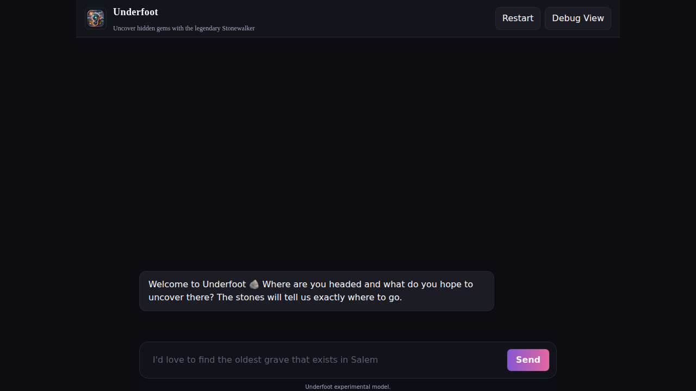

# User Guide Index

*Underfoot - Your guide to discovering hidden gems and authentic travel experiences*

Complete documentation for using Underfoot to discover hidden gems and plan authentic travel experiences.

## 🚀 Start Here

**New to Underfoot?** Begin with these essentials:

- **[Quick Start How-To Guide](./how-to-guide.md)** - Get started in under 10 minutes
- **[How to Use the Chat Interface](./getting-started/chat-interface.md)** - Master the basics
- **[Understanding Your Results](./getting-started/understanding-results.md)** - Interpret recommendations

## 📚 Complete Documentation

### Getting Started
- **[Chat Interface](./getting-started/chat-interface.md)** - Basic interaction and messaging
- **[Understanding Results](./getting-started/understanding-results.md)** - How to interpret recommendations
- **[Tips for Better Recommendations](./getting-started/tips.md)** - Query optimization strategies

### Core Features
- **[Chat-Based Planning](./features/chat-planning.md)** - Conversational travel planning
- **[Result Cards](./features/result-cards.md)** - Understanding recommendation details
- **[Debug View](./features/debug-view.md)** - Power user technical information
- **[Mobile Experience](./features/mobile.md)** - Using Underfoot on mobile devices

### Troubleshooting & Optimization  
- **[Common Issues](./troubleshooting/common-issues.md)** - Solutions to frequent problems
- **[Getting Better Results](./troubleshooting/better-results.md)** - Advanced optimization techniques

## 🎯 By Use Case

### First-Time Users
1. [Quick Start How-To Guide](./how-to-guide.md)
2. [Chat Interface](./getting-started/chat-interface.md) 
3. [Understanding Results](./getting-started/understanding-results.md)

### Mobile Users
1. [Mobile Experience](./features/mobile.md)
2. [Chat Interface](./getting-started/chat-interface.md)
3. [Common Issues](./troubleshooting/common-issues.md) (mobile troubleshooting)

### Power Users  
1. [Getting Better Results](./troubleshooting/better-results.md)
2. [Debug View](./features/debug-view.md)
3. [Chat-Based Planning](./features/chat-planning.md)

### Travel Planners
1. [Chat-Based Planning](./features/chat-planning.md)
2. [Result Cards](./features/result-cards.md)
3. [Tips for Better Recommendations](./getting-started/tips.md)

## 🔗 Quick Reference

### Essential Query Examples
- **Outdoor**: `"Hidden hiking trails near Portland Oregon, locals only"`
- **Food**: `"Family-owned restaurants in Austin Texas, not on travel blogs"`
- **Culture**: `"Underground music venues in Nashville, intimate spaces"`  
- **General**: `"Small towns around Denver, authentic local experiences"`

### Common Interface Actions
- **Send message**: Type and press Enter or click Send
- **Open Debug View**: Click "Debug View" button (top right)
- **View result details**: Click "Learn More" on result cards
- **Copy information**: Use Copy buttons in Debug View

### Quick Troubleshooting
- **No results**: Broaden location or simplify criteria
- **Too mainstream**: Add "locals only" or "hidden gems"
- **Slow response**: Check connection, simplify query
- **Mobile issues**: Try browser zoom, rotate device

## 📱 Mobile Quick Start

1. **Open** Underfoot in mobile browser
2. **Tap** message input area  
3. **Type** travel query (e.g., "Coffee shops near me, locals love")
4. **Tap** Send button
5. **Scroll** through results and tap "Learn More" links

## 🛠️ Technical Information

### System Requirements
- **Browser**: Chrome 90+, Firefox 88+, Safari 14+, Edge 90+
- **Device**: Modern smartphone or computer  
- **Connection**: Internet required for searches
- **JavaScript**: Must be enabled

### Performance Notes
- **Response times**: <2 seconds typical, up to 5 seconds acceptable
- **Cache**: Results cached for faster repeat queries
- **Mobile**: Optimized for touch interfaces and small screens

## 🎓 Learning Path

### Beginner (15 minutes)
1. [Quick Start How-To Guide](./how-to-guide.md) - 10 min
2. [Chat Interface](./getting-started/chat-interface.md) - 5 min

### Intermediate (30 minutes)  
1. [Understanding Results](./getting-started/understanding-results.md) - 10 min
2. [Result Cards](./features/result-cards.md) - 10 min
3. [Tips for Better Recommendations](./getting-started/tips.md) - 10 min

### Advanced (45 minutes)
1. [Chat-Based Planning](./features/chat-planning.md) - 15 min
2. [Debug View](./features/debug-view.md) - 15 min  
3. [Getting Better Results](./troubleshooting/better-results.md) - 15 min

### Expert (60 minutes)
- Complete all documentation sections
- Practice advanced query techniques
- Experiment with Debug View features
- Master mobile and desktop workflows

## 🆘 Need Help?

### Self-Service Resources
1. **[Common Issues](./troubleshooting/common-issues.md)** - Most problems and solutions
2. **[Debug View](./features/debug-view.md)** - Technical troubleshooting
3. **[Getting Better Results](./troubleshooting/better-results.md)** - Query optimization

### Before Contacting Support
- Try troubleshooting steps in [Common Issues](./troubleshooting/common-issues.md)
- Check Debug View for technical information
- Note your browser, device, and exact error messages
- Include steps to reproduce the problem

## 🗺️ What Makes Underfoot Special

### Underground Focus
- **Filters out mainstream** tourist attractions automatically
- **Emphasizes local sources** like community forums and regional blogs  
- **Prioritizes authenticity** over convenience or commercial appeal
- **Discovers recent gems** that locals are talking about now

### Local Community Sources
- **Reddit communities** and neighborhood forums
- **Independent local blogs** and publications
- **Hobby communities** (hiking groups, food enthusiasts, photographers)
- **Regional magazines** and area guides with local expertise

### Quality Curation
- **4-6 carefully selected** recommendations per query
- **Source transparency** so you know where recommendations come from
- **Detailed explanations** of what makes each place special
- **Local context** to help you understand and respect communities

---

**Ready to explore?** Start with the [Quick Start How-To Guide](./how-to-guide.md) or jump into the [Chat Interface](./getting-started/chat-interface.md).

*Discover the underground. Respect the local. Support the authentic.* 🌍